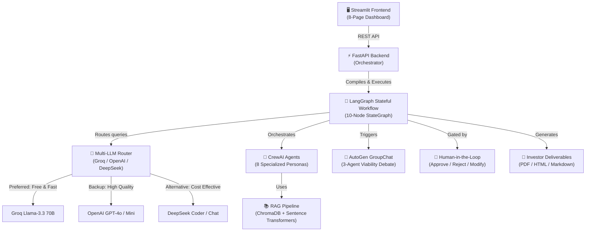

# 🏗️ StartupPilot AI — System Architecture & Design Guide

StartupPilot AI is an enterprise-grade multi-agent platform designed to automate end-to-end startup viability research, strategic planning, cloud system design, and cost projection. It uses state-of-the-art frameworks like **LangGraph** for structured orchestration, **CrewAI** for individual agent execution, and **AutoGen** for group debate simulation.

---

## 📌 Table of Contents
1. [System Overview](#-system-overview)
2. [LangGraph Orchestration State Machine](#-langgraph-orchestration-state-machine)
3. [Specialized CrewAI Agent Personas](#-specialized-crewai-agent-personas)
4. [AutoGen Viability Debate GroupChat](#-autogen-viability-debate-groupchat)
5. [Structured Knowledge Wiki & RAG Pipeline](#-structured-knowledge-wiki--rag-pipeline)
6. [LLM Routing & Fallback Mechanism](#-llm-routing--fallback-mechanism)
7. [API Endpoint Reference](#-api-endpoint-reference)

---

## 🖥️ System Overview

The system consists of three main tiers:
1. **Frontend Dashboard (Streamlit)**: A premium dark-themed web interface offering real-time task tracking, human-in-the-loop validation, debate transcripts, interactive wiki exploration, and document uploading.
2. **Backend API Server (FastAPI)**: Coordinates state transitions, triggers background jobs, processes file uploads, compiles reports, and logs routing decisions.
3. **Multi-Agent Engine**: Combines **LangGraph** (to control process flow), **CrewAI** (for task execution via specific toolsets), and **AutoGen** (for interactive debates).



---

## 🔄 LangGraph Orchestration State Machine

Unlike linear multi-agent chains, StartupPilot AI utilizes **LangGraph** to model a stateful, branching, and human-gated workflow. 

### State Definition
The orchestrator maintains a global `AnalysisState` object containing:
- **Project Details**: `project_id`, `startup_idea`
- **Agent Outputs**: Research summaries, SWOT metrics, competitor lists, business plans, architecture schematics, and financial reports.
- **Workflow State**: `status` (running, pending, awaiting_approval, completed, rejected), `current_step` (node in execution), and lists of `errors`.
- **System Metrics**: `execution_metrics` (timestamps, execution times per node), and `llm_routing_log` (model, tokens, cost, latency).
- **RAG & Wiki Data**: Traces, path memories, and wiki compilation status.

### Graph Architecture (10 Nodes)

```mermaid
graph TD
    START([START]) --> R["1. Research Node<br/>(Senior Analyst)"]
    R --> MA["2. Market Analysis<br/>(TAM/SAM/SOM Sizing)"]
    MA --> CA["3. Competitor Analysis<br/>(Competitive Map)"]
    CA --> SW["4. SWOT Analysis<br/>(Actionable Matrix)"]
    SW --> BS["5. Business Strategy<br/>(GTM & Roadmap)"]
    BS --> HA{"6. Human Approval Gate<br/>(Human-in-the-Loop)"}
    
    HA -->|Approve| AG["7. AutoGen Debate<br/>(Cons, Arch, Fin Debate)"]
    HA -->|Modify| BS
    HA -->|Reject| END2([END: Rejected])
    
    AG --> ARCH["8. Cloud Architecture<br/>(AWS/GCP Scalable Design)"]
    ARCH --> RPT["9. Report Generation<br/>(Compile Deliverables)"]
    RPT --> MEM["10. Long-Term Memory<br/>(Store for future runs)"]
    MEM --> END([END: Complete])
    
    style START fill:#0d0f12,stroke:#7f5af0,stroke-width:2px;
    style HA fill:#1f1b3d,stroke:#7f5af0,stroke-width:2px;
    style END fill:#0d0f12,stroke:#2cb67d,stroke-width:2px;
    style END2 fill:#0d0f12,stroke:#cf6679,stroke-width:2px;
```



---

## 🤖 Specialized CrewAI Agent Personas

The system coordinates 8 distinct autonomous agent roles defined in `agents/crew_agents.py` with unique backstories and expertise:

| Agent Role | Goal | Core Skills | Tools Used |
| :--- | :--- | :--- | :--- |
| **Senior Research Analyst** | Conduct comprehensive industry research, trends, and regulations. | Trend Spotting, Tech Enablers | Search, RAG |
| **Senior Market Analyst** | Sizing customer opportunity and calculating TAM/SAM/SOM. | Market Sizing, Segmentation | Search, RAG |
| **Competitive Intelligence Specialist** | Map direct and indirect competitors with SWOT traits. | Competitor Mapping, Barrier Assessment | Search, RAG |
| **SWOT Strategist** | Formulate SWOT matrix and action strategies (SO/WT). | Strategic Risk & Opportunity mapping | Search, RAG |
| **Senior Business Consultant** | Define the business model, GTM strategy, and roadmaps. | Business Modeling, GTM Plan | Search, RAG |
| **Principal Cloud Architect** | Design scalable, secure cloud-native architecture. | System Design, Cloud Services (AWS/GCP) | Search, RAG |
| **Cloud Financial Analyst** | Estimate infrastructure costs for MVP, Growth, and Scale. | FinOps, Pricing, Cost Optimizations | Search, RAG |
| **Senior Technical Writer** | Synthesize all logs and plans into a professional report. | Report writing, data synthesis | None |

---

## 💬 AutoGen Viability Debate GroupChat

Before cloud resources are planned, the system triggers a simulated executive debate under `autogen_module/` to stress-test the viability of the business model.

### Debate Members
1. **Business Consultant**: Defends the market feasibility and user growth strategy.
2. **Cloud Architect**: Focuses on potential technical debt, scalability boundaries, and security.
3. **Financial Analyst**: Criticizes cost estimations, cash flow, and ROI margins.

### Flow Mechanism
- The debate operates for a configurable number of rounds (default: `6` rounds).
- A group chat manager monitors the conversation and routes the next speech turn dynamically.
- The compiled transcript is fed into the architecture and reporting steps to address flaws.

---

## 📚 Structured Knowledge Wiki & RAG Pipeline

Instead of standard, flat RAG vector retrieval, StartupPilot AI utilizes a **Structured Knowledge Wiki** located in `knowledge_wiki/` and `research_platform/`.

```
                    ┌─────────────────────────┐
                    │  Uploaded References   │
                    └────────────┬────────────┘
                                 │
                                 ▼
                     [ Document Ingestion ]
                                 │
                                 ▼
                    ┌─────────────────────────┐
                    │  ChromaDB Vector Store  │
                    └────────────┬────────────┘
                                 │
                                 ▼
                 [ Knowledge Compiler Agent ]
                                 │
                                 ▼
              ┌─────────────────────────────────────┐
              │          Structured Wiki            │
              │   Topic Pages     │  Entity Pages   │
              │  (Category-based) │ (AWS, APIs etc) │
              └──────────────────┬──────────────────┘
                                 │
                                 ▼
                   [ Multi-Hop Search Agent ]
                                 │
          ┌──────────────────────┴──────────────────────┐
          ▼                                             ▼
[ Follow backlinks/topics ]                  [ Extract evidence logs ]
```

1. **Ingestion Layer**: Uploaded documents are parsed, chunked, and embedded into **ChromaDB** using `sentence-transformers/all-MiniLM-L6-v2`.
2. **Knowledge Compiler**: An agent compiles these raw chunks into structured **Topic** and **Entity** wiki pages. Topics cover high-level subjects while Entities catalog specific technologies, APIs, or competitors.
3. **Multi-Hop Navigator**: Agents explore the Wiki using a graph-like traversal (up to 4 hops), clicking on links and related topics to discover deep relationships instead of simple keyword queries.

---

## 🔀 LLM Routing & Fallback Mechanism

The router (`llm_router/router.py`) handles request dispatching based on task complexity:

- **Routing Rules**: Predefined mappings routing analytical tasks (like Business Strategy or Cloud Architecture) to premium models (GPT-4o) and research tasks to fast models (Groq Llama-3.3-70B).
- **Latency & Cost Tracker**: Records input/output tokens, time elapsed, and estimated costs in USD.
- **Automatic Fallback**: If a provider (like Groq) reaches rate limits or is unavailable, the router automatically fails over to a secondary provider (like OpenAI GPT-4o-mini) and logs a warning.

---

## ⚡ API Endpoint Reference

The backend exposes a FastAPI application with REST endpoints:

### Health & Info
* `GET /health`: Returns service health status and current timestamp.
* `GET /agents`: Lists all 8 CrewAI agents, their goals, icons, and skills.

### Analysis Lifecycle
* `POST /analyze`: Starts a new startup analysis. Runs nodes 1-5 asynchronously in the background.
  * *Request Body*: `{ "startup_idea": "string", "project_id": "string" }`
* `GET /status/{project_id}`: Returns progress, execution metrics, current step, and routing log.
* `POST /workflow/{project_id}/approve`: Submits human approval feedback to resume or reject a paused workflow.
  * *Request Body*: `{ "action": "approve|modify|reject", "comments": "string" }`

### RAG & Uploads
* `POST /upload`: Indexes a document (PDF, TXT, DOCX, MD) into the project's vector database and triggers wiki compilation.

### Reports & Deliverables
* `GET /report/{project_id}`: Compiles and exports the analysis report.
  * *Query parameter `format`*: `json` (default), `md` (markdown), `html` (styled webpage), `pdf` (compiled document).
* `GET /metrics/{project_id}`: Returns performance statistics, execution latency per node, and API charges.

### Knowledge Wiki
* `GET /wiki/{project_id}`: Returns compilation stats (number of pages, entities, sources).
* `GET /wiki/{project_id}/pages`: Lists all compiled Topic and Entity pages.
* `GET /wiki/{project_id}/page/{page_id}`: Retrieves the detailed contents and backlinks of a specific page.
