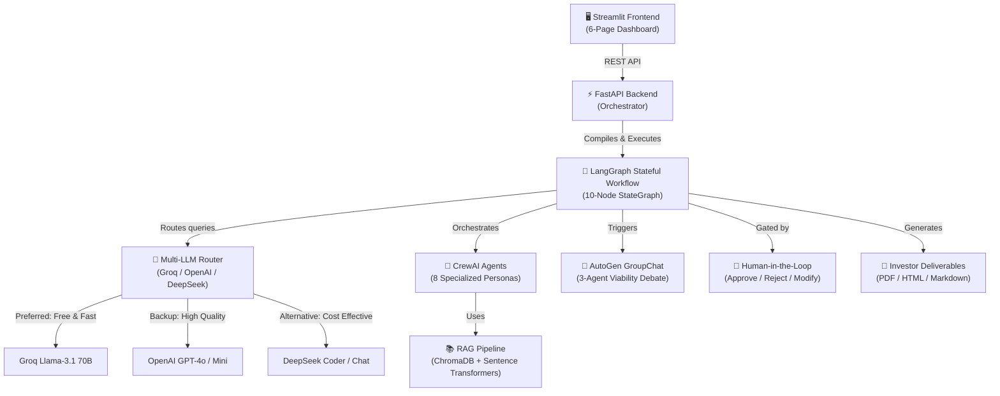

# 🚀 StartupPilot AI

### Enterprise-Ready Multi-Agent Startup Intelligence Platform

StartupPilot AI is a portfolio-grade, production-designed system that orchestrates a team of 8 specialized autonomous AI agents using **LangGraph**, **CrewAI**, and **AutoGen**. 

A user inputs a startup idea, and the platform automatically researches the industry, analyzes the market, identifies competitors, conducts a SWOT analysis, generates business strategies, designs a secure cloud architecture, estimates infrastructure cost, triggers a multi-agent debate to stress-test viability, and compiles everything into an investor-grade report (PDF, HTML, MD).

---

## 🏗️ System Architecture



---

## 🔄 Stateful Orchestration (The 10-Node Graph)

Instead of basic linear chains, StartupPilot AI manages state, loops, and human feedback using a custom **LangGraph StateGraph** featuring a conditional routing node.

```mermaid
graph TD
    START([START]) --> R["1. Research Node"]
    R --> MA["2. Market Analysis"]
    MA --> CA["3. Competitor Analysis"]
    CA --> SW["4. SWOT Analysis"]
    SW --> BS["5. Business Strategy"]
    BS --> HA{"6. Human Approval Gate"}
    
    HA -->|Approve| AG["7. AutoGen Debate"]
    HA -->|Modify| BS
    HA -->|Reject| END2([END: Rejected])
    
    AG --> ARCH["8. Cloud Architecture & Cost"]
    ARCH --> RPT["9. Report Generation"]
    RPT --> MEM["10. Long-Term Memory"]
    MEM --> END([END: Complete])
    
    style START fill:#0d0f12,stroke:#7f5af0,stroke-width:2px;
    style HA fill:#1f1b3d,stroke:#7f5af0,stroke-width:2px;
    style END fill:#0d0f12,stroke:#2cb67d,stroke-width:2px;
    style END2 fill:#0d0f12,stroke:#cf6679,stroke-width:2px;
```



---

## 🌟 Key Technical Features

1. **Stateful LangGraph Workflow**: Manages complex agent execution loops, conditional branching (re-run strategies if user feedback requests modifications), and transactional state transitions.
2. **Knowledge Wiki (Structured Ingestion Layer)**: Instead of passive RAG, a **Knowledge Compiler Agent** processes uploads and agent outputs into structured Topic and Entity pages. Agents browse this wiki using backlinks and keyword indexing, avoiding flat, noisy vector chunks.
3. **Agentic Research Planner**: Before executing, the platform decomposes research goals into concrete sub-questions and seeds targeted wiki pages for investigation.
4. **Multi-Hop Traversal & Evidence Vault**: Agents navigate the wiki network step-by-step (up to 4 hops), following cross-references, extracting specific evidence claims, logging their internal reasoning monologue, and saving optimal paths in Research Memory.
5. **Specialized CrewAI Agents**: Employs 8 distinct expert personas (Research, Market, Competitors, SWOT, Consultant, Architect, Financial Analyst, Writer) configured with target goals and local system tools.
6. **Multi-Agent AutoGen Debate**: Simulates an executive meeting where the Business Consultant, Cloud Architect, and Financial Analyst debate viability and stress-test assumptions.
7. **Intelligent Multi-LLM Router**: Automatically routes tasks to the best-suited model (e.g. Research $\rightarrow$ Groq Llama-3.1 70B; Architecture $\rightarrow$ GPT-4o) with fallback mechanisms and latency logging.
8. **Human-in-the-Loop Gateway**: Pauses the workflow before resource-intensive nodes, allowing users to review drafts, request modifications, or reject the concept entirely.
9. **Demo Mode (No API Keys)**: Pre-cached database scenarios that simulate completed agent chains and pre-compiled wiki indexes instantly.

---

## 📂 Project Structure

```
startuppilot-ai/
├── config.py                 # Central configuration (Pydantic-Settings, routing rules, paths)
├── start.py                  # Local dev launcher (runs FastAPI + Streamlit concurrently)
├── Dockerfile                # Multi-stage production container build
├── docker-compose.yml        # Docker compose configuration (services + volumes)
│
├── backend/
│   ├── main.py               # FastAPI server app config & CORS middleware
│   ├── routes.py             # REST API endpoints (lifecycle, uploads, reports, wiki, research)
│   ├── models.py             # Pydantic request/response schemas
│   └── services.py           # File upload handler & RAG pipeline integration
│
├── frontend/
│   ├── app.py                # Streamlit app shell & master premium dark theme CSS
│   └── pages/                # Multi-page dashboard interface
│       ├── 1_🏠_Home.py      # Landing page & Demo Mode triggers
│       ├── 2_🚀_Analysis.py  # Analysis console & Human-in-the-Loop gateway
│       ├── 3_🤖_Agent_Monitor.py # Live model routing logs & latency stats
│       ├── 4_💬_Discussion.py # Interactive chat bubble debate transcripts
│       ├── 5_📄_Reports.py   # Compiled strategy reports & PDF/HTML downloads
│       ├── 6_📤_Upload.py    # Document upload for RAG collections
│       ├── 7_📖_Knowledge_Wiki.py # Category browse & search for Topic/Entity wiki pages
│       └── 8_🔬_Research_Explorer.py # Visualizes multi-hop timelines, reasoning, and evidence
│
├── knowledge_wiki/           # Compiler, Context Assembler, and Navigator for the Wiki
├── research_platform/        # Planner, Multi-Hop Navigator, trace log, and path memory
├── agents/                   # CrewAI agents & core LangChain wrappers
├── workflows/                # LangGraph StateGraph orchestrator and state TypedDict
├── autogen_module/           # AutoGen debate GroupChat configuration
├── rag/                      # Document loaders & ChromaDB vector store
├── reports/                  # PDF, HTML, and Markdown report compilers
├── demo/                     # Pre-cached database scenarios and pre-compiled wiki caches
└── tests/                    # Pytest suite with mock LLM routers (29 unit & integration tests)
```

---

## 🚀 Setup & Installation

### Option 1: Local Installation

1. **Clone the repository and enter the directory:**
   ```bash
   cd startuppilot-ai
   ```

2. **Create and activate a virtual environment:**
   ```bash
   python -m venv venv
   # On Windows:
   venv\Scripts\activate
   # On macOS/Linux:
   source venv/bin/activate
   ```

3. **Install dependencies:**
   ```bash
   pip install -r requirements.txt
   ```

4. **Configure environment variables:**
   Copy the `.env.example` file to `.env` and fill in your keys (at least one is required, but you can run Demo Mode without keys):
   ```bash
   cp .env.example .env
   ```

5. **Start the application:**
   Launch the backend server and Streamlit UI concurrently with the launcher script:
   ```bash
   python start.py
   ```
   Open your browser and navigate to the Streamlit app: **http://localhost:8501**

---

### Option 2: Docker Compose (All Services)

To run the containerized backend and frontend services together:
```bash
docker-compose up --build
```
The Streamlit app will be live on **http://localhost:8501** and the FastAPI documentation on **http://localhost:8000/docs**.

---

## 🧪 Testing & Verification

Run the test suite containing integration mocks for LLM routing and workflow completion:
```bash
pytest tests/ -v
```
